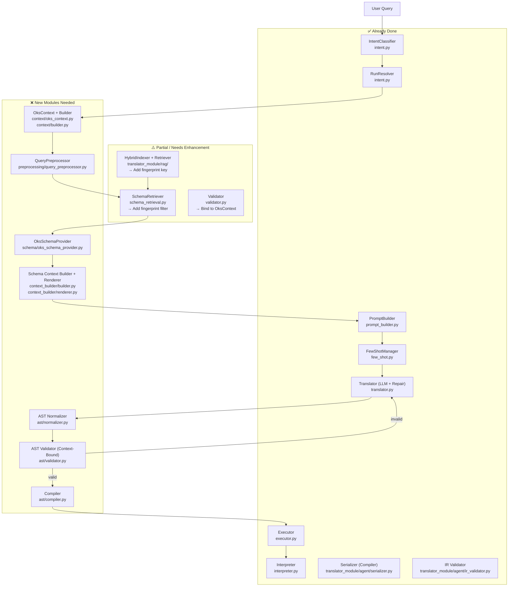

# NL → OKSQuery Architecture: Integration Guide

> **Purpose**: This document maps the 12-module architecture described in
> `nl_to_oksquery_architecture.pdf` to what already exists in this codebase
> and spells out exactly what needs to be built, refactored, or wired together
> to complete the design.

---

## 1. Architecture Overview (from the PDF)

The architecture defines a **12-module, context-locked pipeline**. The single most
important rule is the **Schema-Context Invariant**:

> _Resolve the `OksContext` once, then use the same immutable object for
> retrieval, schema expansion, prompting, validation, repair, compilation, and
> execution. No module may silently substitute a different schema version._

### 10-Stage Information Flow

| Stage | Data Object | Description |
|-------|------------|-------------|
| 1 | `UserQuery` | Raw natural-language question |
| 2 | `ContextSelector` | Release / tag / commit / run / config revision |
| 3 | `OksContext` | Revision + configuration + schema fingerprint + bound OksKernel |
| 4 | `QueryAnalysis` | Normalized terms, entities, constraints |
| 5 | `VersionScopedRetrievalResult` | Candidates filtered by schema fingerprint |
| 6 | `AuthoritativeSchema` | Classes, members, relationships, inheritance from bound kernel |
| 7 | `RenderedSchemaContext` | Schema slice + revision provenance |
| 8 | `QueryRequest` | Immutable `OksContext` + `QueryAST` (JSON IR) |
| 9 | `ValidationResult` | Same-context validity + diagnostics |
| 10 | `OKSQuery + Context Provenance` | Final deterministic OKSQuery string |

---

## 2. What Already Exists

### 2.1 `oksquery_translator/` — Primary Package

| File | PDF Module | Status |
|------|-----------|--------|
| [`intent.py`](file:///home/rhythm/Projects/cern_daq/cern/oksquery_translator/intent.py) | **Module 1 (Version/Run Resolver)** + Stage 2 | ✅ **Done** — `IntentClassifier` classifies 4 intents; `RunResolver` validates run numbers via `rn_ls` / git tags and resolves to version tags (`tag:r<run>@<partition>`); `extract_run_and_partition` is deterministic |
| [`pipeline.py`](file:///home/rhythm/Projects/cern_daq/cern/oksquery_translator/pipeline.py) | Top-level orchestrator | ✅ **Done** — `OksPipeline.answer()` wires all modules; handles all 4 intent branches, version conflict detection, and context header injection |
| [`schema_retrieval.py`](file:///home/rhythm/Projects/cern_daq/cern/oksquery_translator/schema_retrieval.py) | **Module 4 (Version-Scoped Schema Retriever)** | ⚠️ **Partial** — keyword→class mapping exists; exact/alias lookups work; **missing**: schema fingerprint filter, BM25/FTS, and embedding-ranked retrieval |
| [`prompt_builder.py`](file:///home/rhythm/Projects/cern_daq/cern/oksquery_translator/prompt_builder.py) | **Module 7 (Query Prompt Builder)** | ⚠️ **Partial** — builds system + user prompts with syntax rules, schema slice, few-shot examples; **missing**: OksContext metadata block (Component C from PDF) |
| [`translator.py`](file:///home/rhythm/Projects/cern_daq/cern/oksquery_translator/translator.py) | **Module 8 (LLM Generator)** + **Module 11 (Repair Engine)** | ✅ **Done** — LLM call, parse, align_to_schema, validate, repair loop (max 3 retries) all wired |
| [`validator.py`](file:///home/rhythm/Projects/cern_daq/cern/oksquery_translator/validator.py) | **Module 10 (AST Validator)** | ⚠️ **Partial** — Layer 1 (local syntax) + Layer 2 (`oks_dump` execution) done; **missing**: explicit `OksContext` binding (validator runs against the live schema, not a fingerprinted snapshot) |
| [`executor.py`](file:///home/rhythm/Projects/cern_daq/cern/oksquery_translator/executor.py) | **Execution** (post-compilation) | ✅ **Done** — `config` module + `oks_dump` dual-backend, temporal version via `TDAQ_DB_PATH` / `TDAQ_DB_VERSION` |
| [`few_shot.py`](file:///home/rhythm/Projects/cern_daq/cern/oksquery_translator/few_shot.py) | **Module 7 Component E** | ✅ **Done** |
| [`interpreter.py`](file:///home/rhythm/Projects/cern_daq/cern/oksquery_translator/interpreter.py) | Post-execution answer synthesis | ✅ **Done** |

### 2.2 `translator_module/` — Experimental AST-first Module

| File | PDF Module | Status |
|------|-----------|--------|
| [`agent/translator.py`](file:///home/rhythm/Projects/cern_daq/cern/translator_module/agent/translator.py) | **Module 8 + Module 9 (AST Normalizer)** | ✅ **Done** — `OksTranslator` produces a JSON IR (AST) instead of raw OKSQuery; `IR_SCHEMA_DESCRIPTION` embeds the full AST schema in the prompt |
| [`agent/ir_validator.py`](file:///home/rhythm/Projects/cern_daq/cern/translator_module/agent/ir_validator.py) | **Module 10 (AST Validator)** | ✅ **Done** — validates the JSON IR structurally |
| [`agent/serializer.py`](file:///home/rhythm/Projects/cern_daq/cern/translator_module/agent/serializer.py) | **Module 12 (Compiler)** | ✅ **Done** — `serialize_ir_to_oks()` deterministically compiles AST → OKSQuery string |
| [`rag/ingest.py`](file:///home/rhythm/Projects/cern_daq/cern/translator_module/rag/ingest.py) | **Module 4 (Schema Index)** | ⚠️ **Partial** — `HybridIndexer` ingests schema XML; **missing**: schema fingerprint keying |
| [`rag/retrieve.py`](file:///home/rhythm/Projects/cern_daq/cern/translator_module/rag/retrieve.py) | **Module 4 (Retrieval)** | ⚠️ **Partial** — `Retriever` returns candidates; **missing**: fingerprint-filtered search |

---

## 3. What Is Missing / Needs to Be Built

### 3.1 `OksContext` Dataclass — **New** (Module 2)

**Status**: ❌ Not implemented.

The PDF defines the single source of truth for every downstream operation:

```python
# Proposed: oksquery_translator/context/oks_context.py

@dataclass(frozen=True)
class OksContext:
    release: str | None           # e.g. "tdaq-13-00-00"
    git_revision: str | None      # git commit SHA
    run_number: int | None        # ATLAS run number
    configuration_revision: str | None
    schema_identifier: str        # e.g. "tdaq-13-00-00"
    schema_fingerprint: str       # SHA-256 of sorted(schema class names)
    # kernel: OksKernel           # bound config.Configuration object (or None)
```

**Where it plugs in**: `pipeline.py`'s `answer()` must construct this object
after `intent_classifier.classify()` resolves the version, and pass it through
to every downstream call.

---

### 3.2 `OksContext` Builder — **New** (Module 2)

**Status**: ❌ Not implemented.

Currently `pipeline.py` resolves `effective_version` as a plain string. This
needs to be promoted into an `OksContext` object so all downstream modules
share exactly the same fingerprint.

**Proposed location**: `oksquery_translator/context/builder.py`

```python
class OksContextBuilder:
    def build(self, version_tag: str, data_file: str) -> OksContext:
        kernel = self._load_kernel(version_tag, data_file)
        fingerprint = self._compute_fingerprint(kernel)
        return OksContext(
            git_revision=..., schema_fingerprint=fingerprint, kernel=kernel, ...
        )

    def _compute_fingerprint(self, kernel) -> str:
        classes = sorted(kernel.get_class_names())
        return hashlib.sha256("|".join(classes).encode()).hexdigest()[:16]
```

---

### 3.3 Query Preprocessor — **New** (Module 3)

**Status**: ❌ Not implemented (intent classification exists but is separate).

The PDF defines a **Query Preprocessor** that runs _after_ intent classification:
- Preserve original query text
- Lowercase/normalize terms
- Extract obvious entity names (hostnames, class names)
- Detect operator hints ("greater than", "=", "starts with")

**Proposed location**: `oksquery_translator/preprocessing/query_preprocessor.py`

```python
@dataclass
class QueryAnalysis:
    original_query: str
    normalized_query: str
    candidate_entities: list[str]   # e.g. ["pc01", "InitTimeout"]
    candidate_classes: list[str]    # e.g. ["Application"]
    constraints: list[dict]         # e.g. [{"attr": "InitTimeout", "op": ">", "val": "2"}]

class QueryPreprocessor:
    def analyze(self, question: str) -> QueryAnalysis: ...
```

**Where it plugs in**: Between `Step 0` (intent) and `Step 1` (translate) in
`pipeline.py`. The `QueryAnalysis` object feeds `SchemaRetriever` with better
entity hints.

---

### 3.4 Schema Fingerprint Filter — **Enhance Existing** (Module 4)

**Status**: ⚠️ `SchemaRetriever` exists but does **not** key on fingerprint.

The PDF requires:
```python
search(
    query="applications running on computer",
    schema_fingerprint=oks_context.schema_fingerprint,
)
```

**Required changes to [`schema_retrieval.py`](file:///home/rhythm/Projects/cern_daq/cern/oksquery_translator/schema_retrieval.py)**:

1. Each `ClassSearchDocument` in the index must carry `schema_fingerprint`.
2. Every `retrieve_for_question()` call must filter by `schema_fingerprint`.
3. The BM25/FTS tier is already planned; add the fingerprint filter as a mandatory `WHERE` clause.

**Retrieval Index Document Format** (per PDF):
```json
{
  "schema_fingerprint": "<fingerprint>",
  "git_revision": "<sha>",
  "class_name": "Application",
  "tokens": ["application", "app"],
  "relationships": ["RunsOn", "BackupHosts"],
  "relationship_targets": ["Computer"],
  "attributes": ["Name", "Parameters", "Logging"]
}
```

---

### 3.5 AST Normalizer — **Wire Existing** (Module 9)

**Status**: ✅ Built in `translator_module/agent/translator.py` but **not integrated** into `oksquery_translator/`.

The `OksTranslator` in `translator_module` already produces a JSON IR/AST.
The `oksquery_translator` pipeline (`Translator` class) currently goes directly
from LLM output to OKSQuery string parsing, skipping the AST intermediate step.

**Integration plan**: Promote the AST-first approach from `translator_module`
into `oksquery_translator`:

```
Current:  LLM → "CLASS: X\nQUERY: ..." → parse → validate → execute
Target:   LLM → JSON AST → normalize → validate → compile → execute
```

**Changes needed**:
- Copy/merge `translator_module/agent/ir_validator.py` →
  `oksquery_translator/ast/validator.py` and bind it to `OksContext`
- Copy/merge `translator_module/agent/serializer.py` →
  `oksquery_translator/ast/compiler.py`
- Update `Translator.translate()` to emit JSON IR, not raw OKSQuery

---

### 3.6 Version-Aware AST Validator — **Enhance Existing** (Module 10)

**Status**: ⚠️ Two validators exist but neither is `OksContext`-bound.

| | `oksquery_translator/validator.py` | `translator_module/agent/ir_validator.py` |
|---|---|---|
| **What it validates** | Final OKSQuery string via `oks_dump` | JSON IR structure (structural only) |
| **Schema-bound?** | Uses live `oks_dump` (no fingerprint) | No schema at all |
| **Repair feedback?** | ✅ Yes — captures `stderr` | ❌ No |

**Required enhancement**: The validator must receive `OksContext` and validate
the AST against that specific fingerprint:

```python
def validate_ast(
    ast: QueryAST,
    oks_context: OksContext,  # ← NEW: bind to exact fingerprint
    schema_provider: OksSchemaProvider
) -> ValidationResult:
    ...
```

---

### 3.7 OKS Schema Provider — **New** (Module 5)

**Status**: ❌ Not implemented as a standalone module.

Currently `SchemaRetriever` wraps `config.Configuration` and `oks_dump` but
exposes only keyword-level class info. The PDF requires an
`OksSchemaProvider` that is formally bound to `OksContext` and provides:

- `get_class(name) → ClassDefinition`
- `get_effective_members(name) → list[Member]` (with inheritance)
- `get_relationships(name) → list[Relationship]`
- `get_all_class_names() → list[str]`

**Proposed location**: `oksquery_translator/schema/oks_schema_provider.py`

This wraps the existing `config.Configuration` / XML parsing from
`schema_retrieval.py` but exposes a clean typed API and is initialized with
the `OksContext` instance.

---

### 3.8 Schema Context Builder / Renderer — **New** (Module 6)

**Status**: ❌ Not implemented as a distinct step.

Currently `PromptBuilder` calls `SchemaRetriever.retrieve_for_question()` and
injects the result as raw text. The PDF separates this into two steps:

1. **Schema Context Builder** — selects candidate classes + expands inheritance
2. **Renderer** — formats the schema context for the LLM, including version provenance

**Proposed location**: `oksquery_translator/context_builder/`

The renderer must append the `OksContext` metadata to every prompt (PDF
Component C):
```
Schema fingerprint: <fingerprint>
Git revision: <sha>
Configuration revision: <config_rev>
```

---

## 4. Integration Map: PDF Modules → Codebase



---

## 5. Recommended Package Restructure

The PDF recommends this layout. Changes from the current structure are marked.

```
oksquery_translator/              ← existing package root
│
├── context/                      ← 🆕 NEW
│   ├── oks_context.py            ← OksContext dataclass (Module 2)
│   ├── builder.py                ← OksContextBuilder
│   └── version_resolver.py       ← promoted from intent.py RunResolver
│
├── schema/                       ← 🆕 NEW
│   ├── oks_schema_provider.py    ← OksSchemaProvider (Module 5)
│   ├── inheritance.py            ← effective member resolution
│   └── relationship.py          ← relationship graph helpers
│
├── retrieval/                    ← 🆕 NEW (merge from schema_retrieval.py)
│   ├── schema_retriever.py       ← fingerprint-filtered retriever
│   ├── schema_index.py           ← ClassSearchDocument index builder
│   ├── exact_lookup.py           ← tier 1: exact class name match
│   ├── alias_lookup.py           ← tier 2: synonym/alias map
│   └── fts.py                   ← tier 3: BM25/full-text search
│
├── context_builder/              ← 🆕 NEW (Module 6)
│   ├── builder.py                ← selects candidate classes + inheritance
│   └── renderer.py              ← formats schema + provenance for LLM
│
├── preprocessing/                ← 🆕 NEW (Module 3)
│   └── query_preprocessor.py    ← QueryAnalysis dataclass
│
├── ast/                          ← 🆕 NEW (Modules 9, 10, 12) — merge from translator_module
│   ├── models.py                 ← QueryAST, QueryRequest Pydantic models
│   ├── normalizer.py             ← operator/path/value normalization
│   ├── validator.py              ← OksContext-bound structural + semantic validation
│   └── compiler.py              ← deterministic AST → OKSQuery string
│
├── translation/                  ← refactor from translator.py
│   ├── prompt_builder.py        ← updated: receives OksContext (→ move here)
│   ├── generator.py             ← LLM call (Module 8)
│   └── repair.py               ← repair loop (Module 11)
│
├── execution/                    ← promote from executor.py
│   └── executor.py
│
├── intent.py                    ← keep as-is (minor: extract RunResolver)
├── few_shot.py                  ← keep as-is
├── interpreter.py               ← keep as-is
├── pipeline.py                  ← refactor: build OksContext, pass through all stages
└── __init__.py
```

---

## 6. Changes to `pipeline.py` (Step-by-Step)

The existing `OksPipeline.answer()` flow needs the following additions between
Steps 0 and 1:

```python
def answer(self, question: str, version: str = None) -> Dict:

    # Step 0: Intent Classification (EXISTING — unchanged)
    intent_info = self.intent_classifier.classify(question)
    # ... (existing out-of-scope and version conflict handling) ...

    # 🆕 Step 0b: Build OksContext (NEW)
    oks_context = self.context_builder.build(
        version_tag=effective_version,
        data_file=self.data_file,
    )
    # oks_context is now passed to ALL downstream calls

    # 🆕 Step 0c: Query Preprocessing (NEW)
    query_analysis = self.query_preprocessor.analyze(question)

    # Step 1: Translate NL → AST (REFACTORED)
    translation = self.translator.translate(
        question=question,
        query_analysis=query_analysis,   # 🆕
        oks_context=oks_context,          # 🆕
    )
    # translation["ast"] is now a QueryAST object, not a raw string

    # 🆕 Step 1b: Normalize AST (NEW)
    normalized_ast = self.ast_normalizer.normalize(translation["ast"])

    # 🆕 Step 1c: Validate against same OksContext (REFACTORED)
    val_result = self.ast_validator.validate(normalized_ast, oks_context)
    # Repair loop triggers here if invalid (max_repair_attempts = 2)

    # 🆕 Step 1d: Compile AST → OKSQuery (NEW)
    oks_query = self.compiler.compile(normalized_ast, oks_context)

    # Step 2: Execute (EXISTING — pass oks_context instead of version string)
    exec_result = self.executor.execute(
        target_class=translation["target_class"],
        query=oks_query,
        oks_context=oks_context,   # 🆕
    )

    # Step 3: Interpret (EXISTING — unchanged)
    ...
```

---

## 7. `translator_module` vs `oksquery_translator`: Recommendation

The two packages overlap significantly. The PDF architecture calls for **one
coherent pipeline**. Recommended consolidation:

| Component | From | To | Action |
|---|---|---|---|
| JSON IR / QueryAST models | `translator_module/agent/translator.py` | `oksquery_translator/ast/models.py` | **Move** |
| IR structural validator | `translator_module/agent/ir_validator.py` | `oksquery_translator/ast/validator.py` | **Move + enhance** (add OksContext param) |
| Compiler / Serializer | `translator_module/agent/serializer.py` | `oksquery_translator/ast/compiler.py` | **Move** |
| RAG HybridIndexer | `translator_module/rag/ingest.py` | `oksquery_translator/retrieval/schema_index.py` | **Move + add fingerprint** |
| RAG Retriever | `translator_module/rag/retrieve.py` | `oksquery_translator/retrieval/schema_retriever.py` | **Merge** into existing |
| CLI | `translator_module/cli.py` | Deprecate / merge with `oksquery_translator` CLI | **Merge** |

Keep `translator_module` only until the migration is complete, then remove it.

---

## 8. What to Build First (Priority Order)

| # | Task | Effort | Unblocks |
|---|------|--------|---------|
| 1 | `OksContext` dataclass + `OksContextBuilder` | Small | Everything |
| 2 | Wire `OksContext` through `pipeline.py` | Small | Fingerprint-scoped validation |
| 3 | `OksSchemaProvider` wrapping existing `config`/XML | Medium | Context-bound validator, renderer |
| 4 | Promote `translator_module` AST + compiler into `oksquery_translator/ast/` | Medium | AST-first generation |
| 5 | `QueryPreprocessor` | Small | Better entity hints to retriever |
| 6 | Fingerprint-keyed `SchemaIndex` (update `schema_retrieval.py`) | Medium | Version-safe retrieval |
| 7 | `SchemaContextBuilder` + `Renderer` (version provenance in prompt) | Small | Correct multi-version prompting |
| 8 | Context-bound `ASTValidator` (replace current `oks_dump`-only validator) | Large | Full same-context validation |
| 9 | BM25 / FTS retrieval tier | Medium | Improved schema recall |

---

## 9. What Must NOT Change

The following existing components already satisfy the PDF's requirements and
should **not** be substantially modified:

- **`intent.py`** — `IntentClassifier` + `RunResolver` + `extract_run_and_partition`
  are the correct implementations of PDF Module 1. The 4-intent taxonomy,
  deterministic regex extraction, and `rn_ls`/git-tag validation all match
  the spec exactly.
- **`executor.py`** — temporal version access via `TDAQ_DB_PATH` /
  `TDAQ_DB_VERSION` already implements the "version-bound OksKernel" concept.
- **`few_shot.py`** / **`interpreter.py`** — these are downstream of the scope
  of the architecture document.
- **The repair loop in `translator.py`** — the 3-retry loop with schema-hint
  injection already matches Module 11's spec (`max_repair_attempts = 2` + LLM
  feedback). Just needs the `OksContext` reference added to the feedback message.

---

## 10. Key Invariant to Enforce in Code Reviews

Every PR touching the pipeline must pass this checklist:

- [ ] `OksContext` is constructed **once** at the start of `pipeline.answer()`.
- [ ] No module creates or loads a second `OksContext` internally.
- [ ] `SchemaRetriever.retrieve_for_question()` always receives
  `schema_fingerprint` and **only** returns documents matching that fingerprint.
- [ ] `ASTValidator` receives `oks_context` and validates against its kernel,
  not a fresh `config.Configuration()` call.
- [ ] `Compiler` never calls the LLM — it is purely deterministic code.
- [ ] Repair messages include `schema_fingerprint` so the LLM knows which
  context is authoritative.
