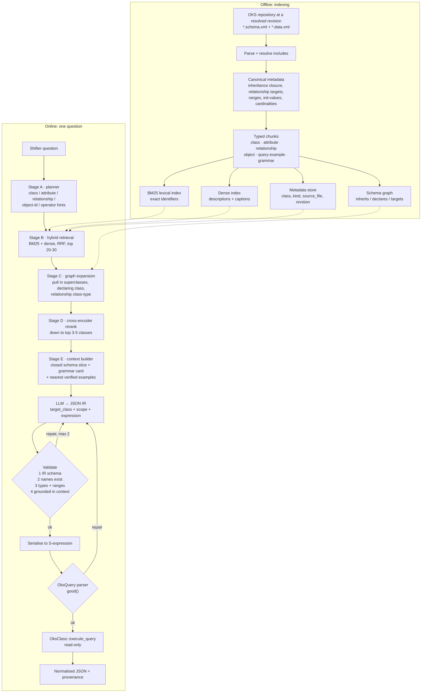

# RAG architecture

How the retrieval layer of the OKS translation pipeline should be built, and why the
current one caps out where it does.

Scope: this document covers **M2, schema discovery** and the retrieval half of **M3,
text-to-OksQuery translation**. The end-to-end MCP flow — run number to git revision to
`OksKernel` to executed query — is in `docs/architecture/architecture_v1.png` and is
unchanged. The retrieval design here plugs into that diagram's "Schema Retriever" box.

---

## 1. Where the current implementation stands

`translator_module` already has the right *shape*: hybrid retrieval, few-shot examples,
an intermediate representation, a validate/repair loop, deterministic serialisation.
That shape is worth keeping. Four things inside it put a ceiling on accuracy that no
amount of prompt tuning will lift.

**Inheritance is not resolved.** `rag/ingest.py` chunks each `<class>` element using its
*direct* children only. `IPCServiceApplication` declares **no** attributes of its own:
all fifteen — `InitTimeout`, `ExitTimeout`, `IfExitsUnexpectedly`, `InterfaceName` and
the rest — are inherited. Its chunk is a bare class name with a description. Retrieve it
and the model is looking at a class that appears to have no properties at all; it will
either refuse or invent some. Across `test_schema/xml` this is the common case, not an
outlier: **50.4% of all resolved attributes (1421 of 2820) are inherited**, and they are
invisible to the index today.

**Chunks drop the metadata that constrains values.** A chunk records
`Attribute: IfExitsUnexpectedly (type: enum)` and stops. The range
`Error,Ignore,Restart,Handle` is not in the chunk, so the model has to guess the
enumerator. Same for numeric ranges, `init-value`, `is-multi-value` and `is-not-null` —
every constraint the validator will later check against is withheld from the step that
has to satisfy it.

**Relationship targets are not followed.** A relationship chunk records the target class
name but never links to it, so the nested expression of `("rel" some <expr>)` cannot be
grounded. This is not a nicety. The OKS parser types a nested expression by the
relationship's `class-type`, so
`("InitializationDependsFrom" some ("InterfaceName" "is/repository" =))` fails to parse:
that relationship targets `BaseApplication`, and `InterfaceName` lives on
`IPCServiceApplicationBase`. A retriever that cannot see the target class cannot warn
the model, and a validator that only checks the outer class will not catch it either.

**The target class never leaves the pipeline.** `OksTranslator.translate()` returns
`oks_query` and `ir`, but an `OksQuery` carries no class — `OksClass::execute_query()`
does, and `oks_dump` takes it as `--class`. Without it the generated query cannot be
executed, and therefore cannot be scored the way the project specification requires.
The IR needs a `target_class` field.

One more, outside the retrieval path but affecting it directly: of the 50 rows in
`oks_scraped/gold_pairs.jsonl` that feed `FewShotManager`, 11 are not queries at all
(they are `oks_dump` command lines or prose) and 12 place a scope token inside an
expression, e.g. `(or (all ("Name" "Fake" =)) (all ("Timeout" "500" >)))`. `all`/`this`
is legal only as the first token of the whole query. Those 12 do not parse. Prompting
with them teaches syntax that fails at the parser.

---

## 2. Design principles

1. **Index structured metadata, not raw XML.** Parse first, chunk along
   class/attribute/relationship boundaries, keep exact identifiers in a lexical field.
2. **Retrieval must return a *closed* schema slice.** Whatever the model is shown has to
   be sufficient on its own: inherited members included, relationship targets included.
   Anything the model must not name should not be in the context.
3. **The schema is authoritative, the index is a cache.** A retrieved name is a
   suggestion; `OksClass::find_attribute()` and `find_relationship()` decide.
4. **Hybrid, because the vocabulary is half natural language and half identifiers.**
   `RunControlApplicationBase` and `IfExitsUnexpectedly` are lexical matches;
   "the host it runs on" → `RunsOn` is a semantic one. Neither retriever gets both.
5. **No fine-tuning anywhere.** Every component is pretrained or deterministic.

---

## 3. Architecture

### Stage A — planner

One cheap LLM call turns the question into retrieval terms before anything is searched:
class hints, attribute concepts, relationship concepts, literal object ids, comparator
hints, and whether the question is a filter or a traversal. Two things come out of it
that a single-shot embedding cannot give you: object ids get quoted verbatim into the
lexical query, and a traversal question ("what does X run on?") gets routed to
relationship navigation or a path query instead of a filter.

### Stage B — hybrid retrieval

BM25 over a lexical field built from exact identifiers (class, attribute, relationship,
object id, enum values), dense retrieval over descriptions and captions, merged with
reciprocal rank fusion. Retrieve **20–30** candidates, not 3. The current `top_k=3` at
this stage is the single cheapest thing to change: recall lost here cannot be recovered
downstream.

Metadata filters — `kind`, `class`, `source_file`, `revision` — do the work that made
`RunsOn` ambiguous in the first place: on `Application` it is a relationship to
`Computer`, on `MIGApplication` it is an enum attribute. Same token, different meaning,
and only a class-scoped filter separates them.

### Stage C — graph expansion

This is the piece missing today, and it is what makes a slice *closed*. For every
candidate class, walk the schema graph and pull in:

* the full superclass chain, so inherited attributes come with it;
* the class that actually declares each attribute (retrieval returns
  `IPCServiceApplication`, `InitTimeout` is declared on `BaseApplication` — both belong
  in the context);
* the `class-type` of every relationship on the candidate, one hop, plus its attributes.

Expansion is deterministic graph traversal, not similarity, so it costs nothing in
recall and it is what makes multi-hop questions answerable at all. It is also the only
way the model can see that a nested expression is typed by the target class rather than
by the outer one.

### Stage D — cross-encoder rerank

Rerank the expanded candidate set with a pretrained cross-encoder (`bge-reranker-base`
or `ms-marco-MiniLM-L-6-v2`) down to 3–5 classes. Pretrained, no training data needed,
and on a small corpus it is the largest single accuracy lever after fixing inheritance.
Rerank at **class** granularity, keeping each class's expanded members attached, so
reranking never breaks a slice apart.

### Stage E — context builder

Emit, in this order:

1. the **grammar card** — operators, operand counts, scope semantics, `some`/`all`,
   the rule that a nested expression is typed by the relationship's `class-type`;
2. the **schema slice** — for each surviving class: description, abstract flag,
   superclasses, every attribute with type/range/init-value/multi-value/declaring class,
   every relationship with target class and cardinality;
3. **object candidates** — exact object ids the planner extracted, resolved against the
   data index, so `(object-id "..." =)` terms are grounded in reality;
4. **nearest verified examples** — few-shot rows retrieved by similarity to the
   question, restricted to rows that parse.

The context is also the **grounding contract**: the validator rejects any IR naming an
element that is not in the slice. That is the Corrective-RAG step, made concrete —
cheaper and stricter than asking a model to grade its own evidence.

### Validation ladder

Six layers, each with a distinct repair action:

| # | Check | Failure |
| --- | --- | --- |
| 1 | IR schema (Pydantic) | missing operator, bad quantifier |
| 2 | Names exist on the right class | `InterfaceName` on `BaseApplication` |
| 3 | Grounded in the retrieved slice | plausible but unretrieved name |
| 4 | Value type / range / enum | `Timeout=50000` outside `1..3600` |
| 5 | Parser: `OksQuery::good()` | unbalanced parens, misplaced scope token |
| 6 | Execution | `oks::QueryFailed` |

Layers 1, 2 and 4 already exist in part; 3 is new and is what stops confident
hallucination. Cap repairs at two attempts and record which layer fired — that record is
the error taxonomy the specification asks for.

---

## 4. What to build, in order

| # | Change | Why it is in this position |
| --- | --- | --- |
| 1 | Resolve inheritance in `ingest.py`; put type, range, init-value, multi-value and the declaring class into every chunk | Largest gap; nothing downstream works without it |
| 2 | Add `target_class` to the IR and to the translator's output | Without it a generated query cannot be executed, so nothing can be scored |
| 3 | Raise retrieval to top 20–30 and add the relationship-target hop | Recall lost at retrieval cannot be recovered |
| 4 | Split chunks by kind (class / attribute / relationship / object) with metadata filters | Enables class-scoped disambiguation |
| 5 | Add the cross-encoder reranker | Biggest precision win once recall is fixed |
| 6 | Add the planner as a pre-retrieval step | Needed for object-id grounding and traversal routing |
| 7 | Add the grounding check (validation layer 3) | Cuts hallucination once the slice is trustworthy |
| 8 | Repair `gold_pairs.jsonl`: drop the 11 non-queries, fix the 12 misplaced scope tokens | Few-shot examples currently teach invalid syntax |
| 9 | Add a path-query node to the IR | Unblocks M6 and the 5 path rows in the eval set |

Steps 1–3 are hours of work and account for most of the achievable gain. Steps 5–6 add a
model call and a reranker to the hot path; measure before adopting.

### GraphRAG, deliberately not adopted

An OKS schema *is* a graph, and the temptation is to build a knowledge graph over it.
That is already what stage C does, using the schema's own inheritance and `class-type`
edges. A separate extracted graph would add an inference step, and a lossy one, on top
of a structure that is already exact. Revisit only if questions start spanning
revisions ("what changed between run A and run B") — that is a different graph, over
`OksRepositoryVersion`, and belongs with M7.

---

## 5. Measuring it

Both evaluations run off the two files in [`eval_dataset/`](eval_dataset/README.md):

* [`eval_dataset/oks_schema_corpus.xml`](eval_dataset/oks_schema_corpus.xml) — 70
  examples, 482 class chunks: the 454 ATLAS TDAQ configuration classes, 825 objects, and
  the OKS C++ API expressed as 22 OKS classes. Drop-in for `ingest_xml`.
* [`eval_dataset/oks_eval_queries.jsonl`](eval_dataset/oks_eval_queries.jsonl) — 144
  questions stratified easy/medium/hard, each with gold IR, gold `OksQuery`, gold schema
  elements and the expected result set.

**M2** scores retrieval precision and recall against `gold_schema_elements`, derived
automatically by walking the ground-truth IR — no separate annotation to drift. Report
classes, attributes and relationships separately; relationship recall is the number that
predicts whether the hard band can work at all.

**M3** scores by executing the generated query and comparing object ids to
`expected_object_ids`, with valid-syntax rate reported separately and failures broken
down by the `constructs` tag rather than collapsed into one number. The four-rung
ablation — plain prompt → +few-shot → +retrieval → +repair loop — runs on the same rows.

Field definitions and the exact metric formulas are in
[`eval_dataset/README.md`](eval_dataset/README.md).

---

## Appendix — the original design note

Kept verbatim; the architecture above is the worked-out form of it, with the GraphRAG
suggestion answered in section 4.

> Hybrid RAG (BM25 + dense embeddings), not pure dense retrieval. Dense-only retrieval
> leans on embeddings that are typically trained/fine-tuned on large corpora — with a
> small corpus, off-the-shelf embeddings can miss exact terminology (particle names,
> dataset IDs, paper titles). BM25 doesn't need training data at all and is excellent at
> exact-term matching, which physics/technical text is full of. Combining both and
> merging results (reciprocal rank fusion) gives you better recall than either alone,
> without needing more data.
>
> Add a reranker (cross-encoder) on top. This is the single biggest lever for accuracy in
> a small-corpus setup. Retrieve a wider candidate set (say top 20–30) with hybrid
> search, then rerank with a pretrained cross-encoder (e.g. bge-reranker or
> ms-marco-MiniLM) down to your top 3–5. Cross-encoders are pretrained, so you get a real
> precision boost with zero fine-tuning — ideal when you don't have data to train your
> own ranker.
>
> If your data is relational/structured (entities, papers, experiments, citations linking
> them) — layer in GraphRAG. This matters more in low-data regimes than high-data ones:
> with few documents, a knowledge graph lets you compensate for scale with explicit
> structure (e.g., "which experiments cite this dataset" becomes a graph traversal
> instead of a hope-the-embedding-catches-it retrieval). For something like
> HEPData/INSPIRE-HEP with clear entity relationships, this is a strong fit.
>
> Add a verification/grounding step (Corrective RAG or Self-RAG style). Before generating
> the final answer, have the model check whether retrieved chunks actually support the
> query, and drop the ones that don't. This directly targets accuracy — it cuts
> hallucination and enforces that every claim in the citation-backed answer actually
> traces to a retrieved chunk.
>
> So concretely: Hybrid retrieval → cross-encoder rerank → (optional) graph-augmented
> retrieval for relational queries → grounded/verified generation with citations. No
> fine-tuning required anywhere in that pipeline, which is exactly what you want with
> limited data.
>
> Reference all the pdfs here, create the very simple python module. Currently I require
> only this and no MCP agent — just to fulfil the requirement of the minor project
> description PDF.
