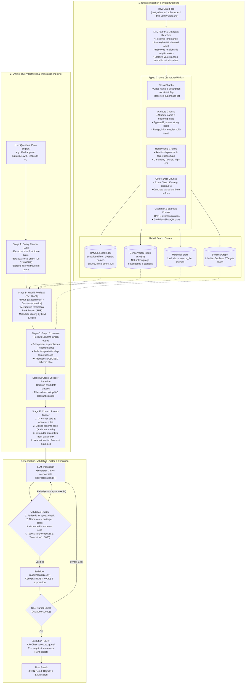

```mermaid
flowchart TB
    %% ==========================================
    %% SUBGRAPH 1: OFFLINE INDEXING & CHUNKING
    %% ==========================================
    subgraph OFFLINE["1. Offline: Ingestion & Typed Chunking"]
        direction TB
        RAW["Raw OKS Files<br/>(test_schema/*.schema.xml + test_data/*.data.xml)"]
        
        PARSE["XML Parser & Metadata Resolver<br/>• Resolves inheritance closure (50.4% inherited attrs)<br/>• Resolves relationship target classes<br/>• Extracts value ranges, enum lists & init-values"]
        
        RAW --> PARSE

        subgraph CHUNKS["Typed Chunks (Structured Units)"]
            C_CLASS["Class Chunks<br/>• Class name & description<br/>• Abstract flag<br/>• Resolved superclass list"]
            C_ATTR["Attribute Chunks<br/>• Attribute name & declaring class<br/>• Type (u32, enum, string, bool)<br/>• Range, init-value, is-multi-value"]
            C_REL["Relationship Chunks<br/>• Relationship name & target class-type<br/>• Cardinality (low-cc, high-cc)"]
            C_OBJ["Object Data Chunks<br/>• Exact Object IDs (e.g. lxplus001)<br/>• Concrete stored attribute values"]
            C_GRAMMAR["Grammar & Example Chunks<br/>• BNF S-expression rules<br/>• Gold Few-Shot Q/A pairs"]
        end

        PARSE --> CHUNKS

        subgraph INDEXES["Hybrid Search Stores"]
            BM25[("BM25 Lexical Index<br/>Exact identifiers, class/attr names,<br/>enums, literal object IDs")]
            DENSE[("Dense Vector Index (FAISS)<br/>Natural language descriptions & captions")]
            META[("Metadata Store<br/>kind, class, source_file, revision")]
            GRAPH[("Schema Graph<br/>Inherits / Declares / Targets edges")]
        end

        CHUNKS --> BM25
        CHUNKS --> DENSE
        CHUNKS --> META
        CHUNKS --> GRAPH
    end

    %% ==========================================
    %% SUBGRAPH 2: ONLINE RETRIEVAL PIPELINE
    %% ==========================================
    subgraph ONLINE["2. Online: Query Retrieval & Translation Pipeline"]
        direction TB
        Q["User Question (Plain English)<br/>e.g. 'Find apps on lxplus001 with Timeout > 50'"]
        
        STAGE_A["Stage A: Query Planner (LLM)<br/>• Extracts class & attribute hints<br/>• Extracts literal object IDs ('lxplus001')<br/>• Detects filter vs traversal query"]
        
        STAGE_B["Stage B: Hybrid Retrieval (Top 20–30)<br/>• BM25 (exact names) + Dense (semantics)<br/>• Merged via Reciprocal Rank Fusion (RRF)<br/>• Metadata filtering by kind & class"]
        
        STAGE_C["Stage C: Graph Expansion<br/>• Follows Schema Graph edges<br/>• Pulls parent superclasses (inherited attrs)<br/>• Pulls 1-hop relationship target classes<br/>➡️ Produces a CLOSED schema slice"]
        
        STAGE_D["Stage D: Cross-Encoder Reranker<br/>• Reranks candidate classes<br/>• Filters down to top 3–5 relevant classes"]
        
        STAGE_E["Stage E: Context Prompt Builder<br/>1. Grammar card & operator rules<br/>2. Closed schema slice (attributes + rels)<br/>3. Grounded object IDs from data index<br/>4. Nearest verified few-shot examples"]

        Q --> STAGE_A
        STAGE_A --> STAGE_B
        BM25 -.-> STAGE_B
        DENSE -.-> STAGE_B
        META -.-> STAGE_B
        
        STAGE_B --> STAGE_C
        GRAPH -.-> STAGE_C
        
        STAGE_C --> STAGE_D
        STAGE_D --> STAGE_E
    end

    %% ==========================================
    %% SUBGRAPH 3: GENERATION & VALIDATION LADDER
    %% ==========================================
    subgraph GENERATION["3. Generation, Validation Ladder & Execution"]
        direction TB
        STAGE_E --> LLM_GEN["LLM Translation<br/>Generates JSON Intermediate Representation (IR)"]
        
        VAL{"Validation Ladder<br/>1. Pydantic IR syntax check<br/>2. Names exist on target class<br/>3. Grounded in retrieved slice<br/>4. Type & range check (e.g. Timeout in 1..3600)"}
        
        LLM_GEN --> VAL
        VAL -- "Failed (Auto-repair max 2x)" --> LLM_GEN
        
        SER["Serializer (agent/serializer.py)<br/>Converts IR AST to OKS S-expression"]
        
        PARSER{"OKS Parser Check<br/>OksQuery::good()"}
        
        EXEC["Execution (CERN OksClass::execute_query)<br/>Runs against in-memory RAM objects"]
        
        ANS["Final Result<br/>JSON Result Objects + Explanation"]

        VAL -- "Valid IR" --> SER
        SER --> PARSER
        PARSER -- "Syntax Error" --> LLM_GEN
        PARSER -- "OK" --> EXEC
        EXEC --> ANS
    end
```